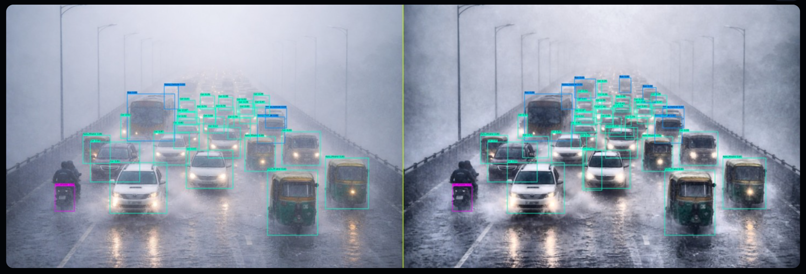
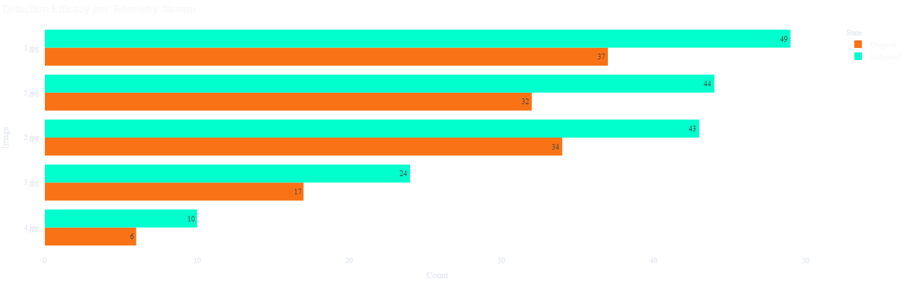
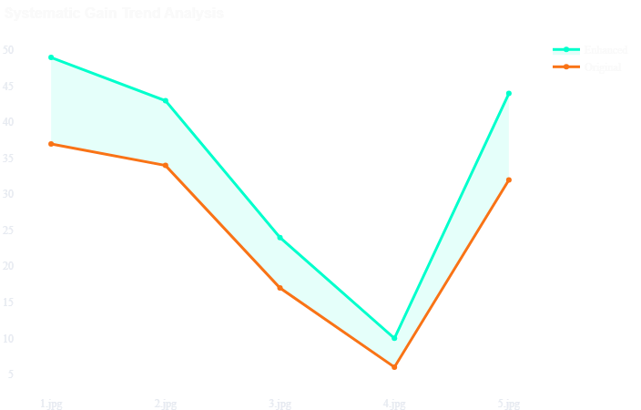
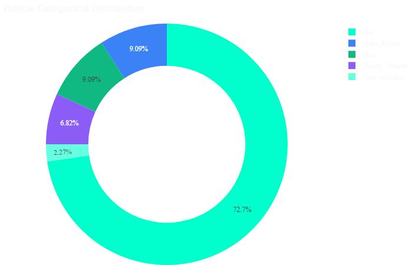
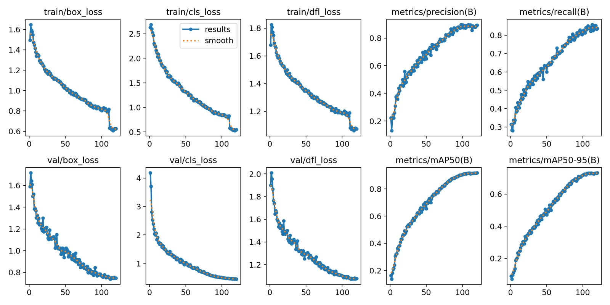
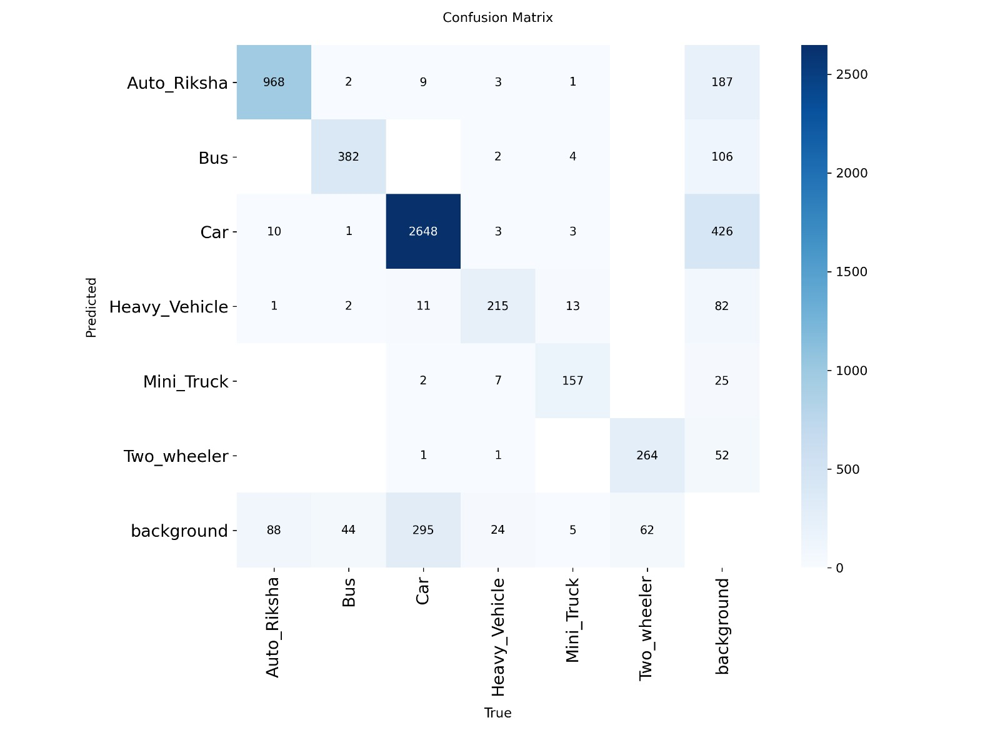

# Vehicle Detection on Indian Roads Under Rainy Weather Using YOLOv8x and Image Enhancement

A robust, weather-aware vehicle detection system built for the chaotic reality of Indian traffic — heterogeneous vehicle types, unstructured roads, and heavy monsoon rain that most detection models were never trained to handle.

📄 **Conference Paper:** *Vehicle Detection on Indian Roads Under Rainy Weather Using YOLOv8x and Image Enhancement Technique*

---

## 🚦 Overview

Standard object detection models are usually trained and benchmarked on clean, structured datasets from Europe, the US, or China — well-marked lanes, predictable traffic, and clear weather. None of that describes an Indian monsoon street: auto-rickshaws weaving between buses, waterlogged roads acting like mirrors, rain streaks blurring object boundaries, and vehicle spray fogging up entire lanes.

This project builds a detection pipeline specifically designed for that environment. It combines a custom-annotated, real-world rainy-weather dataset with a **self-built adaptive image enhancement pipeline** on top of a fine-tuned YOLOv8x model — improving detection recovery on degraded (rain/fog/low-light) images with no observed regressions across evaluated test scenes.

> **A note on scope:** The full proposed methodology, including a SAHI-based 4-quadrant tiled-inference strategy and IoM (Intersection over Minimum) duplicate suppression, is described in detail in the accompanying conference paper. This repository contains the components that were implemented and used to generate the paper's enhancement and training results: the adaptive enhancement pipeline, the YOLOv8x training pipeline, the dynamic per-class confidence filter, and a clean-vs-rain-vs-enhanced evaluation dashboard. The tiled-inference module is documented in the paper as proposed/future-facing architecture and is not included as standalone runnable code here.

---

## 🎯 Problem Statement

Rainy weather degrades vehicle detection accuracy through:
- **Rain streaks and noise** — high-frequency visual interference that obscures object edges
- **Low light / overcast conditions** — reduced contrast and visibility
- **Fog and haze** — washed-out colors and contrast, especially at range
- **Blur** — from rain-soaked lenses or camera shake
- **Highly heterogeneous traffic** — cars, auto-rickshaws, two-wheelers, buses, and trucks sharing the same unstructured lanes with no consistent discipline

Existing global datasets (Cityscapes, BDD100K, DAWN, ACDC) don't capture this combination of adverse weather *and* Indian road chaos — which is the gap this project addresses with a purpose-built dataset and pipeline.

---

## 🧩 Key Components (implemented in this repo)

### 1. Custom Real-World Rainy Dataset
- ~3,000 images collected from mobile cameras, CCTV, and dashcams across Indian urban roads, highways, and congested intersections during actual monsoon conditions
- Filtered down to **1,800 high-quality images** after removing blur, occlusion, and redundant samples
- Manually annotated in **Label Studio** (no AI-assisted labeling) across **6 vehicle classes**: Car, Bus, Heavy Vehicle, Auto-Rickshaw, Two-Wheeler, Mini Truck
- Split 70:20:10 (train:val:test)

### 2. Adaptive Image Enhancement Pipeline
Rather than applying a fixed sequence of filters to every image, the pipeline first **diagnoses** what's actually wrong with a given frame, then applies only the fixes needed:

- **Degradation profiling** — measures Laplacian variance (blur), mean brightness (low light), dark-channel mean (fog), and noise level to detect which condition(s) apply
- **Low-light correction** — gamma lift + CLAHE (on the LAB L-channel) to recover shadow detail without blowing out headlights/highlights
- **Rain/noise removal** — Non-Local Means denoising, tuned to preserve vehicle edges while removing rain streaks and grain
- **Fog removal** — Dark Channel Prior dehazing to recover contrast in hazy/foggy frames
- **Blur correction** — unsharp masking to recover crisp edges on rain-blurred frames

This adaptive, condition-based approach means a clean image passes through untouched, while a degraded image only gets the specific corrections it needs — avoiding the artifacts that come from over-processing already-good images.

### 3. Dynamic Per-Class Confidence Filtering
Detection confidence thresholds are adjusted per vehicle class rather than using one global cutoff:
- **Two-wheelers/bikes:** lower threshold (≥0.15) to aggressively capture small, faint profiles
- **Heavy vehicles/buses/trucks:** higher threshold (≥0.45) to reduce false positives from overlapping large objects
- **Standard vehicles (cars, etc.):** baseline threshold (≥0.25)

### 4. Clean vs. Rain vs. Enhanced Evaluation Pipeline
An end-to-end evaluation script that:
- Runs the trained YOLOv8x model on paired **clean**, **rain-degraded**, and **enhanced** versions of the same scenes
- Counts detected vehicles per class in each condition
- Builds a comparison CSV and generates bar/line charts plus a summary dashboard, visually and numerically demonstrating the enhancement pipeline's impact on detection recovery

---

## 📊 Results

**Model:** YOLOv8x, transfer-learned from COCO pre-trained weights
**Training:** 120 epochs, AdamW optimizer, cosine LR decay, batch size 4, input size 640×640

| Metric | Value |
|---|---|
| Precision | 0.89 |
| Recall | 0.84 |
| mAP@0.5 | 0.918 |
| mAP@0.5–0.95 | 0.73 |
| Peak F1 Score | 0.86 (at confidence threshold 0.426) |

**Per-class Average Precision (highlights):**
| Class | AP |
|---|---|
| Mini Truck | 0.970 |
| Auto-Rickshaw | 0.936 |
| Car | 0.932 |
| Bus | 0.928 |
| Heavy Vehicle | 0.881 |
| Two-Wheeler | 0.861 |

**Enhancement impact:** Across evaluated rainy test images, the enhancement pipeline improved recovered detections in every evaluated case, with no observed regressions. Example: one test image went from 37 → 49 detected vehicles after enhancement (+12), another from 6 → 10 (+4) even in a low-yield scene.

**Detection comparison (original vs. enhanced):**



**Detection efficacy per test image (original vs. enhanced counts):**



**Systematic gain trend across test images:**



**Vehicle class distribution across the evaluation set:**



**Training/validation loss** converged smoothly across 120 epochs with no significant train-val divergence, indicating the model generalized well without overfitting.



**Confusion matrix (normalized):**



*(See `/output` folder for full-resolution versions of these images, plus `args.yaml` — the auto-generated Ultralytics training configuration log confirming the exact hyperparameters used for this run.)*

---

## 🔍 SAHI Tiled-Inference — Concept Illustration

As noted above, the SAHI-based 4-quadrant tiled inference and IoM duplicate suppression described in the paper are not included as standalone code in this repository. The image below is a screenshot from an early prototype used to visually validate the concept — splitting a frame into 4 quadrants and running detection on each slice to recover small/distant vehicles that a single full-frame pass misses.


*(Illustrative only — this demonstrates the concept was tested; the prototype's source code is not part of this repository.)*

---

## 🛠️ Tech Stack

- **Detection Model:** YOLOv8x (Ultralytics)
- **Enhancement:** OpenCV, scikit-image (CLAHE, Dark Channel Prior dehazing, Non-Local Means denoising, gamma correction, unsharp masking)
- **Evaluation:** Pandas, Matplotlib (comparison dashboard, CSV export)
- **Annotation:** Label Studio
- **Core Libraries:** Python, OpenCV, NumPy, Pandas, PyTorch
- **Performance:** GPU acceleration (CUDA) where available

---

## 📁 Repository Structure

```
Vehicle-Detection-System/
├── vehicle_detection.py     # Basic single-image YOLOv8x inference script
├── enhanced_pipeline.py     # Adaptive image enhancement pipeline (blur/low-light/fog/rain)
├── final_pipeline.py        # Clean vs. rain vs. enhanced evaluation + dashboard generator
├── training.py               # YOLOv8x training configuration and script
├── requirements.txt          # Dependencies
├── test_images/              # Sample test images
├── output/                   # training_results.jpeg, confusion_matrix.jpeg, args.yaml,
│                              # detection_comparison.png, detection_efficacy_comparison.png,
│                              # gain_trend_analysis.png, vehicle_class_distribution.png
└── demo/                     # sahi_concept_demo.jpeg (illustrative prototype screenshot only)
```

---

## 🚀 How to Run

1. Clone the repository
   ```
   git clone https://github.com/hemantkumar734/Vehicle-Detection-System.git
   ```
2. Install dependencies
   ```
   pip install -r requirements.txt
   ```
3. Run basic detection
   ```
   python vehicle_detection.py
   ```
4. Run the clean vs. rain vs. enhanced comparison pipeline (requires `clean/`, `rain/`, and `model/best.pt` set up as described in `final_pipeline.py`)
   ```
   python final_pipeline.py
   ```

---

## 🔭 Why This Matters

India recorded a significant number of road accidents in recent years, with adverse weather a contributing factor. Reliable vehicle detection under rain isn't just a computer vision benchmark — it's a real gap for intelligent transportation systems, ADAS, and traffic monitoring deployed in Indian conditions. This project is a step toward detection systems that hold up in the environment they'll be deployed in, rather than just the one they were trained on.

---

## 👤 Author

**Hemant Kumar Singh**
Final-year B.Tech, Information Technology & Data Science, Ajeenkya DY Patil University
📧 hemantkumar.s734@gmail.com
🔗 [LinkedIn](https://www.linkedin.com/in/hemant-singh-3aa705318)
💻 [GitHub](https://github.com/hemantkumar734)
